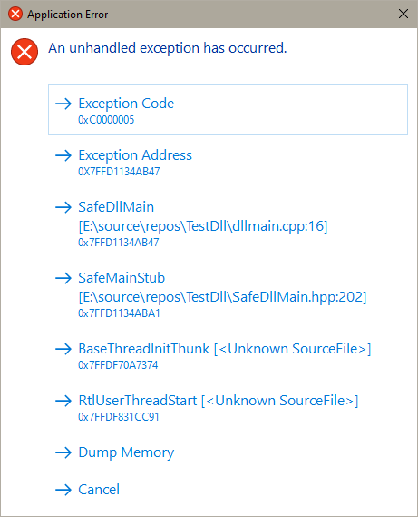

# Safe DLL Main

### The Pitch:
A relatively safe DllMain wrapper implementation. 
- Works by creating a thread on load and calls your DllMain code inside a SEH exception handled stub, provides a simple Crash Dialog on exceptions that looks like the following:



> Clicking any of the Call Stack entries copies the exception address, except "Dump Memory" which creates a full memory .dmp in the same folder as the running process.

## Usage Example:
You can import the provided .zip file as a Visual Studio Project Template or Use the header file directly in your current project.  

```cpp
#include "SafeDllMain.hpp"
#include <print>

void SafeDllMain()
{
    std::println("SafeDllMain called");

    MessageBoxA(
        nullptr,
        "SafeDllMain called",
        "SafeDllMain",
        MB_OK | MB_ICONINFORMATION);

    int* p = nullptr;
    *p = 0xDEADBEEF;
}
```

Or if on different thread

```cpp
SetUnhandledExceptionFilter(SafeDllMainUtil::CrashHandler);
```
